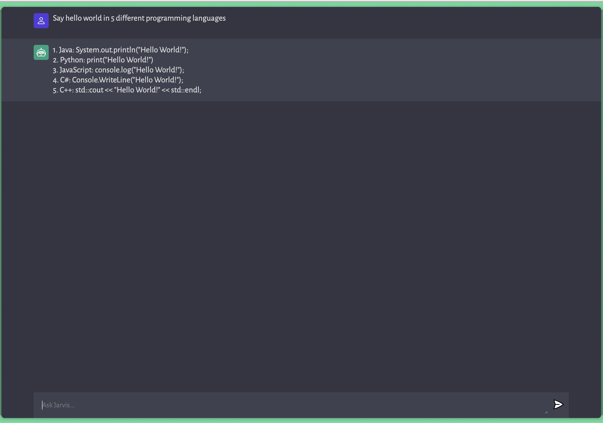

# OpenAI_ChatGPT_Clone

This repository contains code for a chatbot using OpenAI's GPT-3 model. The chatbot is trained on a dataset of conversations and can be used to generate responses to user input.

GPT-3 models can understand and generate natural language. These models were superceded by the more powerful GPT-3.5 generation models which I am currently working to make the change to begin using the GPT-3.5-turbo model within my clone.

This repository also contains a web application that allows users to interact with the chatbot. The web application is written in JavaScript, html, and css. It uses the vite framework for the frontend and uses the OpenAI API to handle requests to the configured server.

If you are interested in using this chatbot, please feel free to clone or fork this repository and use it as you wish. If you have any questions or suggestions, please open an issue or contact me directly.

#

# Tech Stack

#

# UI Screenshot

**Asking my clone a question** 

#
